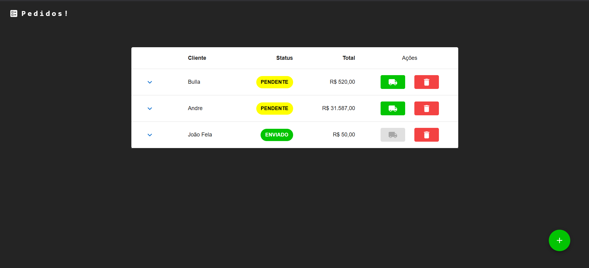
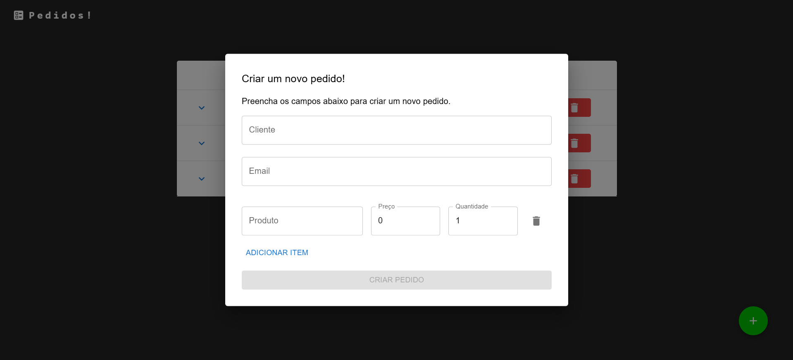
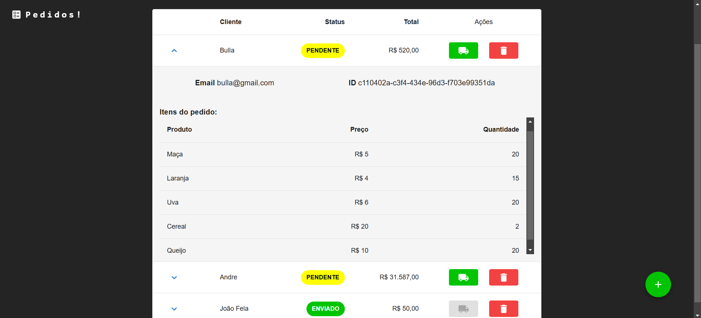

## **Gerenciador de Pedidos Serverless**  

Este projeto foi desenvolvido com **ReactJS** e tem como objetivo consumir uma **API da AWS** utilizando **funções Lambda** para o gerenciamento de pedidos de forma eficiente e escalável. 

Como é apenas para testar minhas funções optei pela simplicidade, porém ainda pensando
no usuário para trabalhar minhas habilidades em **Frontend**.

